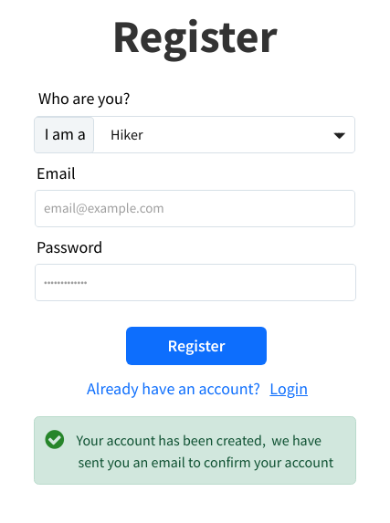
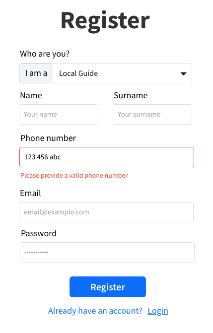

This project has been developed by Team-09 for the course of "Software Engineering II", attended during the academic year 2022/23 at Politecnico di Torino, Master's Degree in Computer Engineering.

## Table of Contents

1. [Docker Documentation](#docker-documentation)
   - [Development](#frontend)
   - [Tests](#tests)
   - [Deploy on Docker Hub](#Deploy-on-Docker-Hub)
   - [Pull from Docker Hub](#Pull-from-Docker-Hub)
2. [Technologies](#technologies)
   - [Frontend](#frontend)
   - [Backend](#backend)
   - [Database](#database)
3. [React Client Application Routes](#react-client-application-routes)
   - [Route `/`](#)
   - [Route `/*`](#1)
4. [API Server](#api-server)
   - [Ticket Routes](#ticket-routes)
     - [`GET /api/tickets/:counterId`](#get-apiticketscounterid)
5. [Database Tables](#database-tables)
   - [Table `Service`](#service)
6. [React Components APIs](#react-components-apis)
7. [Testing](#testing)
8. [Mocks](#mocks)

## Docker Documentation

### Development

This command allows to run both client and server in development mode.

```
docker-compose up
```

### Tests

You can run tests in interactive mode with commands:

```
docker-compose run --rm client-tests
docker-compose run --rm server-tests
```

For running both tests and the app (suitable for a fast check, not for the real development):

```
docker-compose --profile test up
```

### Production

```
docker-compose -f docker-compose.prod.yml stop && docker-compose -f docker-compose.prod.yml up --build -d
```

the ```-f``` flag is for custom docker file path

### Deploy on Docker Hub

Be sure that the .env file is in /server directory

```
docker login
docker-compose -f docker-compose.prod.yml build
docker-compose -f docker-compose.prod.yml push
```

### Pull from Docker Hub

This repo has two images, one for the user interface and one for the server logic. Both images can be pulled with:

```
docker pull andreadeluca/se_2022_09_hike_tracker:client
docker pull andreadeluca/se_2022_09_hike_tracker:server
```

When images are built, you can run them with:

```
docker run -d -p 3001:3001 --name se09-server andreadeluca/se_2022_09_hike_tracker:server
docker run -d -p 3000:80 --name se09-client --link se09-server:server andreadeluca/se_2022_09_hike_tracker:client
```
The app can be reached on http://localhost:3000

Note:

- the images se09-client depends on the se09-server one, so this must be run first
- in case of name conflicts, remove the containers with ```docker rm <name>``` and run again the commands above

## Technologies

### Frontend

The language used is `Javascript` and the framework choosen is `ReactJS`.

Here the list of dependencies installed:

```json
"dependencies": {
    "@testing-library/jest-dom": "^5.16.5",
    "@testing-library/react": "^13.4.0",
    "formik": "^2.2.9",
    "react": "^18.2.0",
    "react-dom": "^18.2.0",
    "react-scripts": "5.0.1",
    "react-toastify": "^9.1.1",
    "web-vitals": "^2.1.4",
    "yup": "^0.32.11"
},
"devDependencies": {
    "@craco/craco": "^7.0.0",
    "@testing-library/dom": "^8.19.0",
    "@testing-library/user-event": "^14.4.3",
    "@types/react-toastify": "^4.1.0",
    "autoprefixer": "^10.4.12",
    "axios": "^1.1.3",
    "bootstrap": "^5.2.2",
    "classnames": "^2.3.2",
    "cypress": "^11.1.0",
    "cypress-dark": "^1.8.3",
    "history": "^5.3.0",
    "leaflet": "^1.9.2",
    "postcss-preset-env": "^7.8.2",
    "react-app-alias": "^2.2.2",
    "react-bootstrap": "^2.5.0",
    "react-icons": "^4.6.0",
    "react-leaflet": "^4.1.0",
    "react-router-dom": "^6.4.3",
    "sass": "^1.55.0"
},
```

### Backend

The language used is `Javascript` and the framework choosen is `ExpressJS`.

Here the list of dependencies installed:

```json
"dependencies": {
   "cors": "^2.8.5",
   "dayjs": "^1.11.5",
   "express": "^4.18.2",
   "express-validator": "^6.14.2",
   "morgan": "^1.10.0",
   "nodemon": "^2.0.20",
   "sqlite3": "^5.1.2"
},
"devDependencies": {
   "babel": "^6.23.0",
   "chai": "^4.3.6",
   "chai-http": "^4.3.0",
   "check-code-coverage": "^1.10.0",
   "jest": "^27.5.1",
   "mocha": "^9.2.2",
   "mochawesome": "^7.1.3",
   "mochawesome-report-generator": "^6.2.0"
}
```

### Database

We've choosen a relational database and the DBMS choosen is `SQLite3`.

For more info about the database structure, see [Database Tables](#database-tables).

## React Client Application Routes

### `/`

_This is the index route_

Homepage for visitor users (not logged in users).

_This route is unprotected from the user authentication. Moreover, it is unreachable when the user is logged in._

### `/*`

Any other route is matched by this one where the application shows an error.

## API Server

### **Ticket Routes**

#### `GET /api/tickets/:counterId`

Get served ticket associated to counterId.

**Request header:**

`Content-Type: application/json`

`Params: req.params.counterId to retrieve the id of the counter.`

**Response body**

`HTTP status code 200 OK`

```json
{
	"ticket": {
		"TicketId": 5,
		"CreateTime": "2022-10-19 17:42:50",
		"ServiceId": 1,
		"Status": "issued",
		"CounterId": 1
	}
}
```

**Error responses**

- `HTTP status code 500 Internal Server Error` (generic server error)
- `HTTP status code 404 Not Found` (resource not found error)
- `HTTP status code 422 Unprocessable Entity` (validation error)

## Database Tables

### `1. User`

It contains info about user.

```
user_id
email
salt
password
firstname
lastname
mobile
role
active(0/1)
```

#### Preloaded Data

| ServiceId | email | salt | password |firstname|lastname|mobile|role|active|
| :-------- | :---------- | :---------- |:---------- |:---------- |:---------- |:---------- |:---------- |:---------- |
| 1         | test@polito.it     | 343cd4a74ae1e4ec          |17e4c86a11f6d9412a89853127f9ae2c|testname|testlastname|390123456789|guide|0|


#### Preloaded User 
| email | password |
| :-------- | :---------- |
|  test@polito.it         | password  |


### `2. Hike`

It contains info about hiking path.

```
hike_id
hut_id
writer_id
track_path
region
city
title
length(km)
expected_time
ascent(m)
difficulty(easy/medium/hard)
description
start_point
end_point
reference_point
```

#### Preloaded Data

| hike_id | hut_id | writer_id | track_path |region |city |title |length(km)|expected_time |ascent(m) |difficulty|description|start_point |end_point |reference_point |
| :-------- | :---------- | :---------- |:---------- |:---------- |:---------- |:---------- |:---------- |:---------- |:---------- |:---------- |:---------- |:---------- |:---------- |:---------- |
| 1         | 1    | path1    |piemonte    |turin         |hiketitle1|1000.7|1:20|237.7|easy| This is the description of hikepath1 |1|1|2|

### `3.Hut`

It contains info about hut.

```
hut_id
hut_name
writer_id
position_id
num_of_beds
cost(euro/night)
```

#### Preloaded Data

| hut_id | hut_name | writer_id | position_id |num_of_beds|cost(euro/night)|
| :-------- | :---------- | :---------- |:---------- |:---------- |:---------- |
| 1         | hutName1     | 1  |1  |10|20.0|

### `4. Hut-Hike`

It contains info between hut and hike.

```
hh_id
hike_id
hut_id
```

#### Preloaded Data

| hut_id | hike_id | hut_id| 
| :-------- | :---------- | :---------- |
| 1         | 1 | 1  |


### `5. Opening_hours`

It contains info between hut and hike.

```
openhour_id
business_id
type(parking/hut)
day
open_time
close_time
```

#### Preloaded Data

| openhour_id | business_id | type|day|open_time|close_time|
| :-------- | :---------- | :---------- |:---------- |:---------- |:---------- |
| 1         | 1 | parking  |1|8:10|20:15|

### `6. Parking`

It contains info about parking a lot.

```
parking_id
parking_name
writer_id
posistion_id
num_of_cars
cost(euro/hour)
```

#### Preloaded Data

| parking_id | parking_name | writer_id |posistion_id|num_of_cars|cost(euro/hour)|
| :-------- | :---------- | :---------- |:---------- |:---------- |:---------- |
| 1         | parking1  |1|1|100|2.0|


### `7. Point`

It contains info about point.

```
point_id
position_id
type(parking/hut)
parking_id
hut_id
name_of_location
```

#### Preloaded Data

| point_id | position_id | type |parking_id|hut_id|name_of_location|
| :-------- | :---------- | :---------- |:---------- |:---------- |:---------- |
| 1         |1| parking  |1||parking1|
| 2         |2| hut  ||1|hut1|
| 3         |3|  |||fountain|

### `8. Position`

It contains info about position.

```
position_id
altitude
latitude
longitude
city
province
address
```

#### Preloaded Data

| position_id | altitude | latitude |longitude|city|province|address|
| :-------- | :---------- | :---------- |:---------- |:---------- |:---------- |:---------- |
| 1         |145.3| -100.3 |12.5|Turin|Piemonte|Turin, Piemonte|
| 2         |122.2| -78.8 |15.5|Turin|Piemonte|Turin, Piemonte|
| 3         |100.3| -45.0 |16.7|Turin|Piemonte|Turin, Piemonte|


## React Components APIs

## Testing

### Backend 

The libraries used for testing are `Jest` for unit testing, `Mocha` and `Chai` for integration testing.

To run the unit tests
```
npm test
```
To run the integration tests
```
npm run integration 
```
#### Note: to run these commands you must be in `/code/server/`


## Mocks


### Login page


### Registration page




### Select Start/Arrival points

