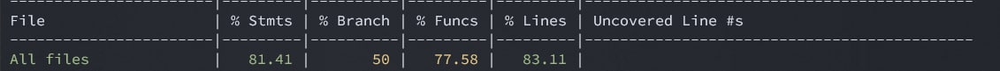
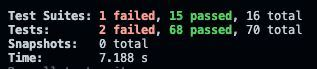

TEMPLATE FOR RETROSPECTIVE (Team 09)
=====================================

The retrospective should include _at least_ the following
sections:

- [process measures](#process-measures)
- [quality measures](#quality-measures)
- [general assessment](#assessment)

## PROCESS MEASURES 

### Macro statistics

- Number of stories committed vs. done 
  -  Number of stories committed: 5
  -  Number of stories done: 2
- Total points committed vs. done 
  - Total of stories committed: 10
  - Total of stories done: 4
- Nr of hours planned vs. spent (as a team)
  - Nr of hours planned: 60 hours 20 minutes
  - Nr of hours spent:  75 hours 

**Remember**a story is done ONLY if it fits the Definition of Done:
 
- Unit Tests passing
- Code review completed
- Code present on VCS
- End-to-End tests performed

> Please refine your DoD if required (you cannot remove items!) 

### Detailed statistics

| Story  | # Tasks | Points | Hours est. | Hours actual |
|--------|---------|--------|------------|--------------|
| _#0_   |    12    |       |   16 hours 20 minutes     |      17 hours 50 minutes          |
| 1     |     5    |     1   |     9 hours 30 minutes       |      12 hours 10 minutes           |
| 2    |     7    |     2   |    9 hours        |     15 hours            |
| 3    |     7    |     2   |    11 hours 30 minutes       |     11 hours  50 minutes         |
| 4    |     6    |     3   |    9 hours 30 minutes       |     8 hours  10 minutes         |
| 5    |     6    |     2   |    10 hours 30 minutes       |     10 hours         |
   

> place technical tasks corresponding to story `#0` and leave out story points (not applicable in this case)

- Hours per task average, standard deviation (estimate and actual)
  - *Estimate:*
    - Average Hours per task: 60.3 /31 = 1.94 hours
    - Standard deviation per task: 0.32
  - *Actual:*
      - Average Hours per task: 75 /31 = 2.42 hours
      - Standard deviation per task: 0.58
- Total task estimation error ratio: sum of total hours estimation / sum of total hours spent - 1
  - Total task estimation error ratio: 60.3 / 75 - 1 = - 0.196

  
## QUALITY MEASURES 

- Unit Testing:
  - Total hours estimated: 14 hourse 20 minutes
  - Total hours spent:  21 hourse 35 minutes
  - Nr of automated unit test cases: 83

- Coverage:
  - BackEnd Test Result 

  - FrontEnd Test Result

- E2E testing:
  - Total hours estimated: 2 hours
  - Total hours spent: 1 hours
- Code review
  - Total hours estimated: 3 hours
  - Total hours spent: 3 hours 5 minutes

  

## ASSESSMENT

- What caused your errors in estimation (if any)?

  
     - The tasks about testing are underestimated
     - The time spend on the merging wasn't considered
     - We didn't create the code review task 
    

- What lessons did you learn (both positive and negative) in this sprint?

  - It's better to assign  the same story to maximum 2 teammates

- Which improvement goals set in the previous retrospective were you able to achieve? 

   - We have improved our code review  
  
- Which ones you were not able to achieve? Why?

- Improvement goals for the next sprint and how to achieve them (technical tasks, team coordination, etc.)

  - Better organize the code review and E2E tasks with reasonable estimated hours.
  - We could add branch check and docker automatic deployment when we merge the branches into main branch.
  - Ensure the API data sending between frontend and backend at the begining of a project.
  - With more scrum meetings to update each teammates progess.

> Propose one or two

- We have better code review strategies and we collaborated more to complete the tasks
- We're trying to find ways to automate tests before merging to simplify everybody's work
