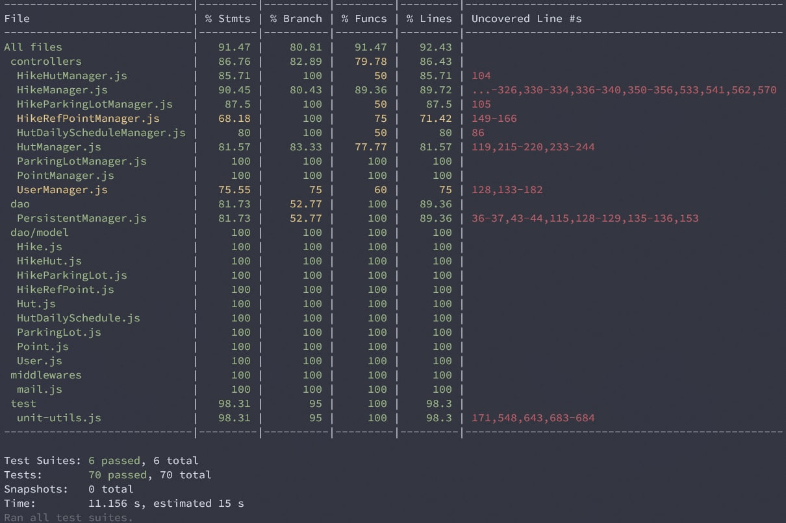
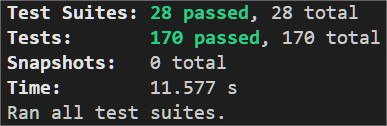

# TEMPLATE FOR RETROSPECTIVE (Team 09)

The retrospective should include _at least_ the following
sections:

- [process measures](#process-measures)
- [quality measures](#quality-measures)
- [general assessment](#assessment)

## PROCESS MEASURES

### Macro statistics

- Number of stories committed vs. done
  - Number of stories committed: 6
  - Number of stories done: 4 
- Total points committed vs. done
  - Total of stories committed: 12
  - Total of stories done: 8
- Nr of hours planned vs. spent (as a team)
  - Nr of hours planned: 74 hours 40 minutes 
  - Nr of hours spent: 78 hours 39 minutes

**Remember**a story is done ONLY if it fits the Definition of Done:

- Unit Tests passing 
- Backend Unit Tests passing
- Code review completed
- Code present on VCS
- End-to-End tests performed

> Please refine your DoD if required (you cannot remove items!)

### Detailed statistics

| Story | # Tasks | Points | Hours est.          | Hours actual        |
| ----- | ------- | ------ | ------------------- | ------------------- |
| _#0_  | 11      |        | 21 hours 35 minutes | 26 hours 05 minutes |
| 1[^1]    | 6       | 1      | 4 hours 10 minutes  | 4 hours 35 minutes  |
| 2     | 4       | 2      | 5 hours 15 minutes  | 4 hours 50 minutes  |
| 3     | 9       | 2      | 12 hours 15 minutes | 18 hours 50 minutes |
| 4[^1]    | 1       | 3      | 30 minutes          | 10 minutes          |
| 5     | 4       | 2      | 3 hours 15 minutes  | 1 hour 40 minutes   |
| 6     | 8       | 2      | 8 hours 40 minutes  | 5 hours 04 minutes  |
| 7     | 8       | 2      | 9 hours 30 minutes  | 11 hours 45 minutes |
| 8     | 8       | 2      | 9 hours 30 minutes  | 5 hours 40 minutes  |

[^1]: We reopened these stories to fix the issues and to adapt them to the most recent requirements   

> place technical tasks corresponding to story `#0` and leave out story points (not applicable in this case)

- Hours per task average, standard deviation (estimate and actual)
  - _Estimate:_
    - Average Hours per task: 74.66 / 48 = 1.55 hours
    - Standard deviation per task: 0.74
  - _Actual:_
    - Average Hours per task: 78.65 / 48 = 1.64 hours
    - Standard deviation per task: 0.84
- Total task estimation error ratio: sum of total hours estimation / sum of total hours spent - 1
  - Total task estimation error ratio: 74.66 / 78.65 - 1 = - 0.05

## QUALITY MEASURES

- Unit Testing:

  - Total hours estimated: 9 hours 40 minutes
  - Total hours spent: 9 hours 55 minutes
  - Nr of automated unit test cases: 240

- Coverage:

  - BackEnd Unit Test Result

    

  - BackEnd Integration Test Result

    

  - FrontEnd Test Result

    

- E2E testing:
  - Total hours estimated: 6 hours 30 minutes
  - Total hours spent: 4 hours 50 minutes
- Code review
  - Total hours estimated: 5 hours 40 minutes
  - Total hours spent: 5 hours 2 minutes

## ASSESSMENT

- What caused your errors in estimation (if any)?

  - We underestimated the Registration (HT-3) story and it slowed down all the tasks depending on this one.  

- What lessons did you learn (both positive and negative) in this sprint?

  - We should do a general review of the committed stories at least one day before the demo day to better prepare it. 

- Which improvement goals set in the previous retrospective were you able to achieve?

  - We created tasks for the code review so we better track it.
  - We considered the time spent for merging and bug fixing.
  - We better estimated tasks about testing.

- Improvement goals for the next sprint and how to achieve them (technical tasks, team coordination, etc.)

  - Improve quality of scrum meetings to detect problems earlier.
  - Improve general organization to be able to deliver a better quality demo.

- One thing you are proud of as a Team!!

  - We improved testing and especially e2e testing with respect to previous sprints.
