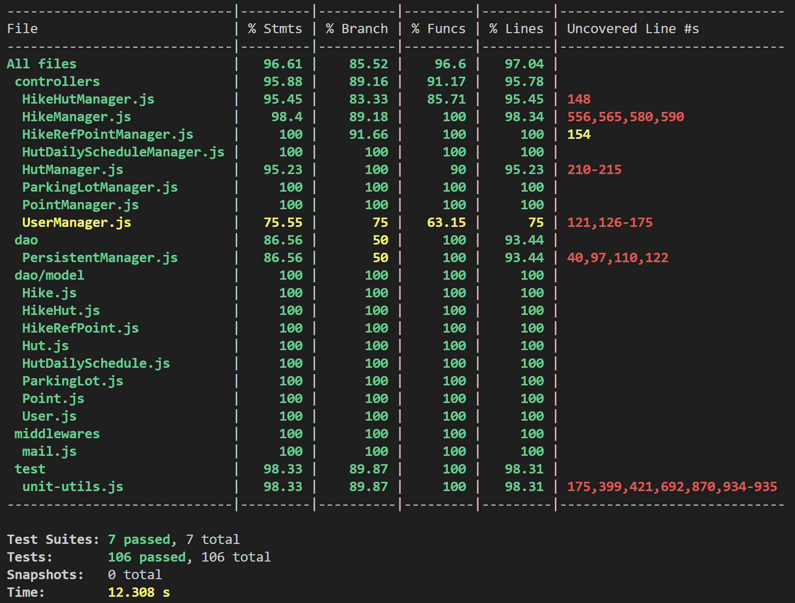
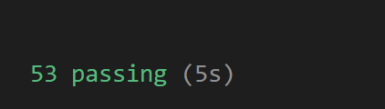
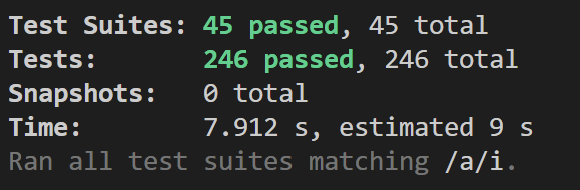

# TEMPLATE FOR RETROSPECTIVE (Team 09)

The retrospective should include _at least_ the following
sections:

- [process measures](#process-measures)
- [quality measures](#quality-measures)
- [general assessment](#assessment)

## PROCESS MEASURES

### Macro statistics

- Number of stories committed vs. done
  - Number of stories committed: 4
  - Number of stories done: 4 
- Total points committed vs. done
  - Total of stories committed: 9
  - Total of stories done: 9
- Nr of hours planned vs. spent (as a team)
  - Nr of hours planned: 79 hours 00 minutes 
  - Nr of hours spent: 75 hours 16 minutes

**Remember**a story is done ONLY if it fits the Definition of Done:

- Unit Tests passing 
- Backend Unit Tests passing
- Code review completed
- Code present on VCS
- End-to-End tests performed

> Please refine your DoD if required (you cannot remove items!)

### Detailed statistics

| Story | # Tasks | Points | Hours est.          | Hours actual        |
| ----- | ------- | ------ | ------------------- | ------------------- |
| _#0_  | 26      |        | 51 hours 45 minutes | 47 hours 41 minutes |
| 7    | 5       | 2      | 6 hours 30 minutes  | 7 hours   |
| 8     | 4       | 2      | 6 hours 30 minutes | 7 hours  |
| 9     | 8       | 2      | 12 hours 45 minutes | 11 hours 35 minutes |
| 33   | 2       | 3      | 1 hours 30 minutes          | 2 hours           |

> place technical tasks corresponding to story `#0` and leave out story points (not applicable in this case)

- Hours per task average, standard deviation (estimate and actual)
  - _Estimate:_
    - Average Hours per task: 79 / 45= 1.76 hours
    - Standard deviation per task: 0.32
  - _Actual:_
    - Average Hours per task: 75.27 / 45 = 1.67 hours
    - Standard deviation per task: 0.25
- Total task estimation error ratio: sum of total hours estimation / sum of total hours spent - 1
  - Total task estimation error ratio: 79 /  75.27 - 1 = 0.05

## QUALITY MEASURES

- Unit Testing:

  - Total hours estimated: 9 hours
  - Total hours spent: 8 hours 
  - Nr of automated unit test cases: 352

- Coverage:

  - BackEnd Unit Test Result

    

  - BackEnd Integration Test Result

    

  - FrontEnd Test Result

    

- E2E testing:
  - Total hours estimated: 13 hours 30 minutes
  - Total hours spent: 13 hours 20 minutess
- Code review
  - Total hours estimated: 6 hours 
  - Total hours spent: 5 hours 50 minutes

- Technical Debt
  - Total hours estimated: 15 hours 10 minutes
  - Total hours spent: 12 hours 35 minutes
  - Hours estimated for remediation by SonarQube： 8 hours
  - Hours estimated for remediation by SonarQube only for the selected and planned issues : 
  - Hours spent on remediation :9 hours 10 min
  - debt ratio (as reported by SonarQube under "Measures-Maintainability") : 0.2 %
  - rating for each quality characteristic reported in SonarQube under "Measures" (namely reliability, security, maintainability )
     - Reliability: A
     - Security: E  
     - Maintainability: A
   
  Firstly, we focused on solving security hotspot, then we tried to fix code smells by severity level ,and in general we improved coverage.

## ASSESSMENT

- What caused your errors in estimation (if any)?

  - We underestimated the SonarCloud coverage setup(HT-222). 

- What lessons did you learn (both positive and negative) in this sprint?

  - We found out the good amount of stories committed for a sprint.

- Which improvement goals set in the previous retrospective were you able to achieve?

  - We evaluated correctly the number of stories to commit.
  - We improved quality of scrum meetings. 
  - We improved general organization to be able to deliver a better quality demo.

- Improvement goals for the next sprint and how to achieve them (technical tasks, team coordination, etc.)

  - Improve even more the technical debt reach over 80% coverage test.
  - Evaluate the time for specific issues on Technical debt

- One thing you are proud of as a Team!!

  - We managed to complete all committed stories , realized better organization .
