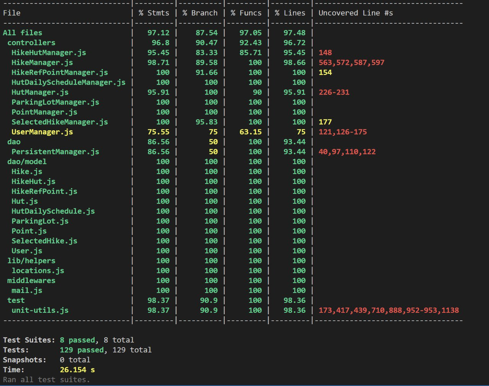
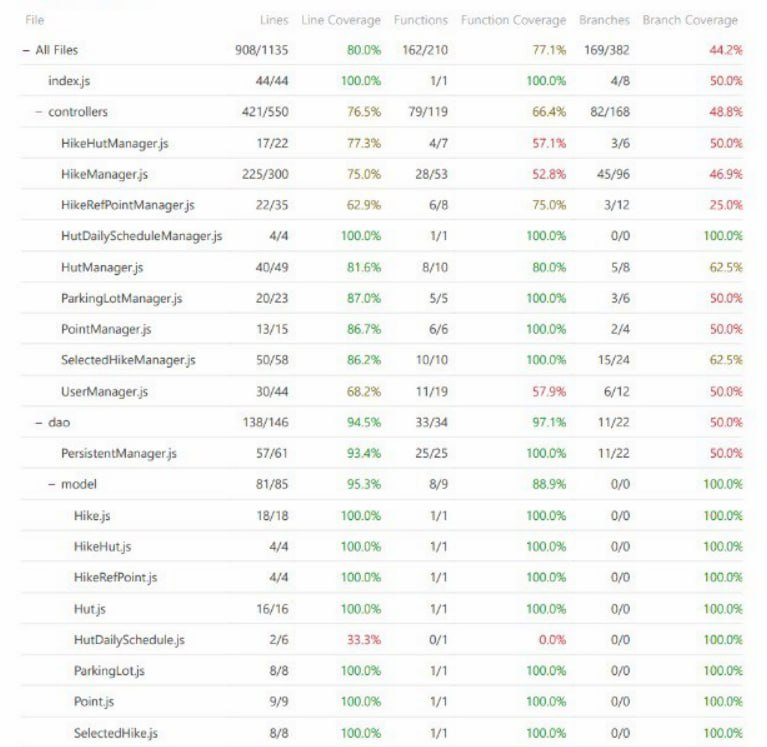
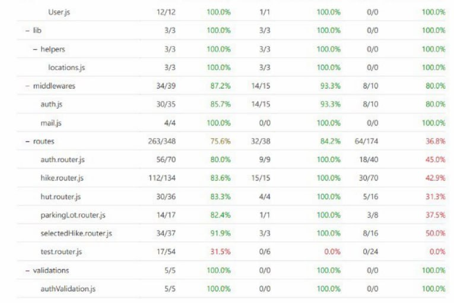
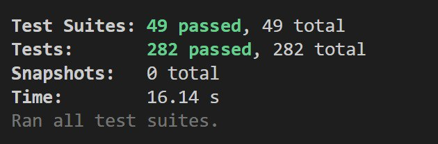
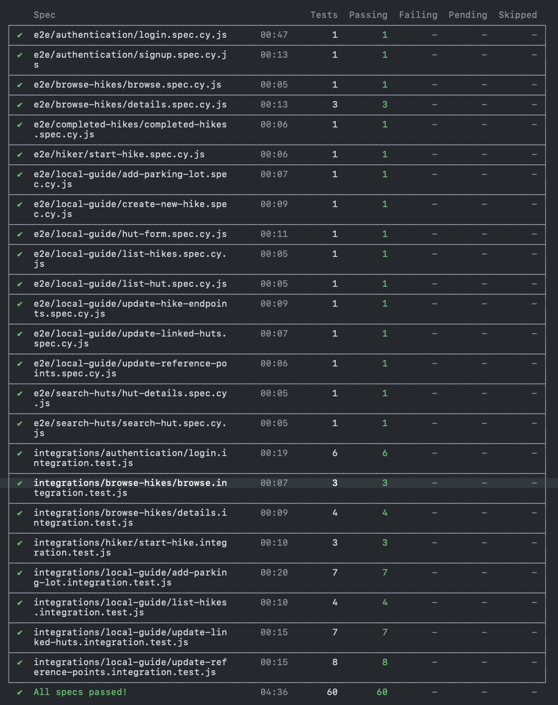

# TEMPLATE FOR RETROSPECTIVE (Team 09)

The retrospective should include _at least_ the following
sections:

- [process measures](#process-measures)
- [quality measures](#quality-measures)
- [general assessment](#assessment)

## PROCESS MEASURES

### Macro statistics

- Number of stories committed vs. done
  - Number of stories committed: 3
  - Number of stories done: 3
- Total points committed vs. done
  - Total of stories committed: 10
  - Total of stories done: 10
- Nr of hours planned vs. spent (as a team)
  - Nr of hours planned: 73 hours 20 minutes
  - Nr of hours spent: 74 hours 40 minutes

**Remember**a story is done ONLY if it fits the Definition of Done:

- Unit Tests passing
- Backend Unit Tests passing
- Code review completed
- Code present on VCS
- End-to-End tests performed

> Please refine your DoD if required (you cannot remove items!)

### Detailed statistics

| Story | # Tasks | Points | Hours est.          | Hours actual        |
| ----- | ------- | ------ | ------------------- | ------------------- |
| _#0_  | 21      |        | 29 hours 50 minutes | 31 hours 00 minutes |
| 17    | 9       | 5      | 12 hours 00 minutes | 10 hours 50 minutes |
| 18    | 8       | 3      | 12 hours 30 minutes | 11 hours 50 minutes |
| 34    | 7       | 2      | 19 hours 00 minutes | 21 hours 00 minutes |

> place technical tasks corresponding to story `#0` and leave out story points (not applicable in this case)

- Hours per task average, standard deviation (estimate and actual)
  - _Estimate:_
    - Average Hours per task: 73.33 / 45 = 1.63 hours
    - Standard deviation per task: 0.47
  - _Actual:_
    - Average Hours per task: 74.66 / 45 = 1.66 hours
    - Standard deviation per task: 0.59
- Total task estimation error ratio: sum of total hours estimation / sum of total hours spent - 1
  - Total task estimation error ratio: 73.33 / 74.66 - 1 = -0.01

## QUALITY MEASURES

- Unit Testing:

  - Total hours estimated: 12 hours 30 minutes
  - Total hours spent: 12 hours 00 minutes
  - Nr of automated unit test cases: 411

- Coverage:

  - BackEnd Unit Test Result

    

  - BackEnd Integration Test Result

    
    

  - FrontEnd Unit Test Result

    

  - E2E Test Result

    

- E2E and Integration testing:
  - Total hours estimated: 11 hours 45 minutes
  - Total hours spent: 11 hours 30 minutess
  - Nr of automated e2e and integration test cases: 129
- Code review

  - Total hours estimated: 9 hours 30 minutes
  - Total hours spent: 9 hours 45 minutes

- Technical Debt
  - Total hours estimated: 5 hours 00 minutes
  - Total hours spent: 4 hours 00 minutes
  - Hours estimated for remediation by SonarQube： 6 hours 30 minutes
  - Hours estimated for remediation by SonarQube only for the selected and planned issues : 6 hours 30 minutes
  - Hours spent on remediation : 4 hours 00 minutes
  - debt ratio (as reported by SonarQube under "Measures-Maintainability") : 0.1 %
  - rating for each quality characteristic reported in SonarQube under "Measures" (namely reliability, security, maintainability, coverage )
    - Reliability: A
    - Security: A
    - Maintainability: A
    - Coverage: 83.4%
  Since we had few code smells, we planned to fix all of them.
  Firstly, we focused on solving security hotspot, then we tried to fix code smells by severity level and in general we improved coverage.

## ASSESSMENT

- What caused your errors in estimation (if any)?

  - We have an error ratio equal to -0.01%, so we think we don't have errors in estimation.

- What lessons did you learn (both positive and negative) in this sprint?

  - We achieved a good result on estimating tasks, since it's the second sprint in a row that we completed all stories we committed.

- Which improvement goals set in the previous retrospective were you able to achieve?

  - We have improved coverage test and now it's 83.4%
  - We better evaluated the time for specific issues on Technical debt

- Improvement goals for the next sprint and how to achieve them (technical tasks, team coordination, etc.)

  - Resolve the last 24 code smells and, eventually, new code smells 

- One thing you are proud of as a Team!!

  - We achieved a good result on estimating tasks and we don't have estimation errors
  - We completed all tasks and we don't have any of them that has to be reopened
  - We managed to fix all the issues, even oldest ones and based on what product owner said about previous stories
